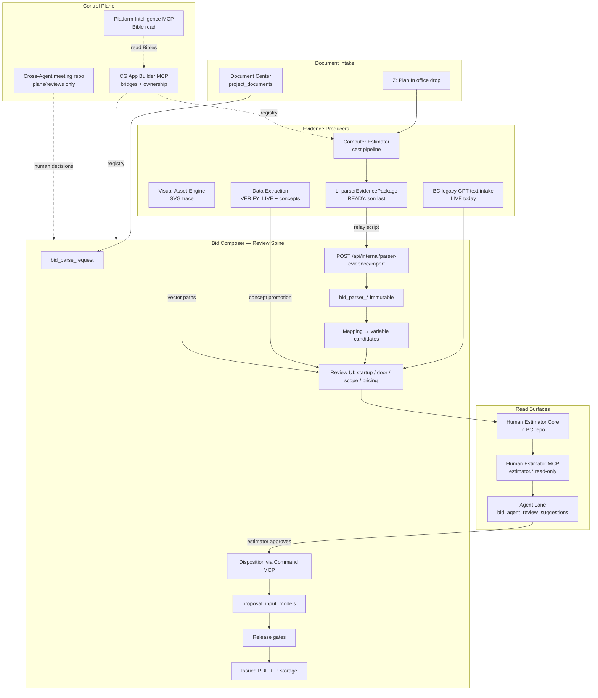

# Capital Glass Estimating Spine — Full Architecture Plan

| Field | Value |
| --- | --- |
| **Document ID** | `estimating-spine-architecture-v1` |
| **Created** | 2026-08-01 17:41 CDT (2026-08-02 03:41 UTC) |
| **Authored by** | Cursor Composer 2.5 (architecture investigation session) |
| **Meeting repo** | [CapitalGlass-Cross-Agent](https://github.com/Capglass5708/CapitalGlass-Cross-Agent) |
| **Folder** | `plans/2026-08-01-estimating-spine-architecture-v1/` |
| **Status** | Reference plan — describes work; does not implement it |
| **Companion** | `MANIFEST.json` (repos, SHAs, references) |

## Repos involved (snapshot at authoring time)

| Repo | Role | Branch @ SHA |
| --- | --- | --- |
| [CG-AppBuilder-MCP](https://github.com/Capglass5708/CG-AppBuilder-MCP) | Control plane, bridges, Bibles, PI MCP | `main` @ `480315c2` |
| [Computer Estimator](https://github.com/Capglass5708/Computer-Estimator) | Parser evidence producer | `main` @ `e0f089c` |
| [CapitalGlass-BidComposer](https://github.com/Capglass5708/CapitalGlass-BidComposer) | Review spine owner | `feat/vercel-observability-v1` @ `82af9f4` |
| [CG-Human-Estimator-MCP](https://github.com/Capglass5708/CG-Human-Estimator-MCP) | HE MCP Bible + launcher | `feat/doppler-control-plane-adoption-v1` @ `19ae400` |
| [Data-Extraction](https://github.com/Capglass5708/Data-Extraction) | Research / VERIFY_LIVE / bridge pointers | `main` @ `2190944` |
| [Visual-Asset-Engine](https://github.com/Capglass5708/Visual-Asset-Engine) | Visual SVG trace lane | `verify/document-visual-production-v1` @ `bb4e24e` |
| [CapitalGlass-Documents](https://github.com/Capglass5708/CapitalGlass-Documents) | Document Layer (plan PDFs) | (not snapshotted locally) |
| [Proposal Generator](https://github.com/Capglass5708/CapitalGlass-Proposal-Generator) | New-construction estimating (separate spine) | (not snapshotted locally) |
| [CapitalGlass-Cross-Agent](https://github.com/Capglass5708/CapitalGlass-Cross-Agent) | This meeting-place repo | `main` @ `e221fde` |

---

This document describes the end-to-end **estimating spine** (also called **proposal spine** or **review spine**): how construction evidence becomes estimator-reviewed scope, priced proposals, and issued customer PDFs — and which repo owns each step.

**One-line position** (from `CapitalGlass-BidComposer/docs/architecture/COMPUTER-ESTIMATOR-PARSER-PLAN.md`):

> **Computer Estimator parses construction documents. Bid Composer composes bids. Human Estimator Core decides readiness.**

---

## 1. Executive model

The spine is **not one app**. It is a **chain of authorities** with hard boundaries:

| Layer | Role | Owns persistence? |
| --- | --- | --- |
| **Document Center** | Canonical project documents (plan PDFs, specs) | `project_documents`, storage |
| **Computer Estimator (CE)** | Construction-document evidence producer | Local Postgres + `L:\Bid Composer Parser\` |
| **Bid Composer (BC)** | Review spine, disposition, pricing, proposal compile/issue | All `bid_*` + `proposal_input_models` |
| **Human Estimator Core** | Pure evaluation (ontology, readiness, truths) | **No tables** — code in BC repo |
| **Human Estimator MCP** | Read-only agent surface over BC state | **No writes** |
| **Command MCP** | Gated mutation adapter (`bidcomposer.*`) | Audit tables only |
| **Visual Asset Engine (VAE)** | Bid-sheet SVG trace (visual lane) | Corpus + vector packages |
| **Data-Extraction (DE)** | Research hub, VERIFY_LIVE logic, bridge pointers | Logic graphs on L: — no runtime coupling |
| **Proposal Generator** | **Separate product** — new-construction estimating | `project_proposal_*`, `openings`, etc. |
| **CG-AppBuilder-MCP** | Suite control plane: bridges, ownership, Bibles, gates | MCP Supabase (not estimating data) |

**Critical split:** Remodel/TI bids flow through **Bid Composer**. New-construction industrial bids route to **Proposal Generator** via DE's `new-construction-proposal-distribution-bridge`. They share concepts but **not** the same `bid_*` tables.

---

## 2. Canonical scope chain

Frozen baseline: `bid-disposition-proposal-spine-baseline-1` / `spine-traceability.json`

```text
parser evidence
  → scope objects + estimating variable instances
  → estimator disposition
  → Human Estimator Core resolution + readiness
  → ProposalInputModel compilation
  → proposal review state
  → issuance + release gate
  → issued PDF snapshot
```

**Protected chain** (mandatory everywhere):

```text
detection → evidence → fact candidate → conflict evaluation
  → estimator review → explicit disposition → proposal application
```

**Forbidden shortcut:**

```text
keyword detected → scope auto-included → quantity accepted → price approved → proposal issued
```

---

## 3. Repo-by-repo responsibilities

### 3.1 Computer Estimator

**Mission:** Phase 1 evidence engine — parse plans, extract regions/tables/text with provenance.

| Owns | Must NOT |
| --- | --- |
| `plan_documents`, `plan_sheets`, `extraction_runs`, region/OCR/embedding tables | Write any `bid_*` table |
| Append-only evidence (no UPDATE/DELETE) | Become proposal compiler |
| `L:\Bid Composer Parser\documents\<id>\` packages | Expose CE Postgres to BC |
| `parserEvidencePackage@1.0.0` contract | Treat `Z:\Office\Plan Parser\Plan Out` as canonical |

**Pipeline stages:** `detect_regions` → `extract_tables` → OCR/layout → package publish (`READY.json` last).

**Office drop:** `Z:\Office\Plan Parser\Plan In` → CE → canonical L: package.

**3-Way sequence (CE):** CE Estimating-Spine Preflight → Evidence Extraction → Parser Pipeline → Package/Office-Drop → Bridge Producer → Golden Regression → Gate → Verification.

---

### 3.2 CapitalGlass-BidComposer

**Mission:** Review spine owner — everything from intake through issued proposal.

| Domain | Key tables |
| --- | --- |
| Intake | `bid_intakes`, `bid_source_files`, `bid_ingestion_runs`, `bid_parse_requests` |
| Parser evidence (immutable) | `bid_parser_imports`, `bid_parser_evidence_items`, `bid_parser_mapping_*` |
| Estimating variables | `bid_scope_objects`, `bid_estimating_variable_*`, `bid_estimator_scope_decisions` |
| Scope / pricing / RFIs | `bid_scope_claims`, `bid_pricing_*`, `bid_rfi_items`, `bid_alternates` |
| Proposal spine | `proposal_input_models`, `bid_proposal_sections`, `bid_issued_proposals` |
| Commands / audit | `bid_command_*`, `bid_agent_review_suggestions` |
| HE persistence (BC-owned) | `bid_estimator_truth_evaluations`, `bid_estimator_overrides`, etc. |

**Human Estimator Core** lives here: `src/lib/human-estimator-core/` — evaluates only, never persists directly.

**Dual-track mode:** Every live proposal (e.g. Submersive) is both customer output **and** system hardening — no Submersive-only hardcodes.

**Live production today:** Legacy GPT structured-text intake (`legacy_structured_text_intake@2.1.0`) via `POST /api/bids/[bidId]/intake`. CE parser bridge is implemented but **feature-flagged off** (`PARSER_EVIDENCE_IMPORT_ENABLED`).

---

### 3.3 CG-Human-Estimator-MCP

**Mission:** Application Bible + launcher for read-only MCP spoke.

| Owns | Does NOT |
| --- | --- |
| HE MCP Bible, contract docs, `mcp/run.mjs` launcher | Implement tools (hosted in BC until extraction) |
| Contract tests against BC host | Any `approve`, `include`, `price`, `persist`, `issue` tools |

**Namespace:** `estimator.*` (~19 tools) — every response `writePerformed: false`.

**Examples:** `estimator.get_startup_parse_summary`, `estimator.get_door_schedule_review_summary`, `estimator.evaluate_estimate_truths`.

---

### 3.4 Data-Extraction

**Mission:** Research + operator-truth hub — **pointer-only bridges**, no runtime coupling.

| Produces | Never does |
| --- | --- |
| VERIFY_LIVE logic graphs (Rosewood, etc.) | Run CE parser as product runtime |
| Concept promotion packages | Write BC Supabase |
| Bridge manifests under `topics/bluebeam-revu/bridges/` | Call HE MCP at runtime |
| OBS capture corpus pointers | Mutate proposals |

**Key bridges:** `computer-estimator-suite-unification-bridge`, `estimating-concept-promotion-bridge`, `estimating-agent-lane-bridge`, `schedule-review-bridge`, `remodel-proposal-distribution-bridge`, `new-construction-proposal-distribution-bridge`.

---

### 3.5 Visual-Asset-Engine

**Mission:** Parallel **visual lane** — Illustrator true-trace of bid-sheet crops to SVG.

| Bridge | `bid-composer-vae-bid-sheet-visuals-v1` |
| --- | --- |
| Output | `vector-document-package-v2@1.0.0` |
| BC writes | Vector path fields on `bid_scope_visuals` / `bid_visual_evidence_*` only |
| Rule | **Facts remain on CE parser evidence** — VAE must not block CE→BC proof |

---

### 3.6 CG-AppBuilder-MCP

**Mission:** Suite control plane — not estimating runtime.

| Provides | Estimating relevance |
| --- | --- |
| `suite-bridge-contracts.ts` | Canonical bridge IDs + wiring |
| `domain-ownership.ts` | `check_table_ownership` — MCP wins on conflict |
| Application Bibles (24 apps) | BC, CE, HE MCP Bibles |
| Platform Intelligence MCP | Read-only Bible access for ChatGPT (`list_application_bibles`, `get_application_bible_context`) |
| Auto Protocol v3.2 | Session preflight, closeout, context compile |
| `cg-suite-wiring` MCP | `describe_bridge`, `resolve_wiring_path` |

**Does NOT:** Store bid data, run parsers, or host estimating writes.

---

### 3.7 CapitalGlass-Cross-Agent (this repo)

**Mission:** GitHub meeting place — `plans/`, `chatgpt-reviews/`, `decisions/`, `cursor-reports/`, `closeouts/`.

**Not:** Bible storage, runtime, database, MCP host. Bibles read via Platform Intelligence → BibleDB.

See [README](https://github.com/Capglass5708/CapitalGlass-Cross-Agent/blob/main/README.md).

---

### 3.8 Proposal Generator (separate repo)

**Mission:** New-construction estimating (`project_proposal_*`, `openings`, door schedules, glass cut lists).

Connected via DE `new-construction-proposal-distribution-bridge`. **Does not share `bid_*` spine** with Bid Composer.

---

### 3.9 Document Center (CapitalGlass-Documents)

**Mission:** Canonical project document engine.

Plans/specs filed here → BC/CE consume via Document Layer routes. BC must not become a second document engine.

---

## 4. End-to-end integration diagram



---

## 5. Suite bridges (integration contracts)

### Registered in CG-AppBuilder-MCP (`suite-bridge-contracts.ts`)

| Bridge ID | Producer → Consumer | Kind | Purpose |
| --- | --- | --- | --- |
| **`computer-estimator-parser-evidence-v1`** | CE → BC | HTTP API | `parserEvidencePackage@1.0.0` → `POST /api/internal/parser-evidence/import` |
| **`computer-estimator-read-status-v1`** | CE → MCP spoke | MCP (planned) | Read L: package status — no relay |
| **`bid-composer-vae-bid-sheet-visuals-v1`** | VAE → BC | MCP | SVG vector paths for visual evidence |
| **`human-estimator-failure-export`** | BC → FI | MCP | HE read failures → Failure Intelligence |
| **`command-mcp-failure-export`** | BC → FI | MCP | Command preview/apply failures |
| **`obs-capture-suite-bridge`** | DE → suite | MCP | Revu video → L: corpus |

### Data-Extraction pointer bridges (`topics/bluebeam-revu/bridges/`)

| Bridge ID | Purpose |
| --- | --- |
| `computer-estimator-suite-unification-bridge` | CE plan evidence + DE operator truth → BC review join |
| `estimating-agent-lane-bridge` | HE read → Agent Lane → Command MCP apply |
| `estimating-concept-promotion-bridge` | VERIFY_LIVE → HE concept registry via BC apply |
| `schedule-review-bridge` | Schedule-review stage handoff (CE, BC, VAE, HE) |
| `remodel-proposal-distribution-bridge` | TI/remodel scope distribution (Crunch fixture) |
| `new-construction-proposal-distribution-bridge` | Routes to **Proposal Generator**, not BC |
| `visual-handoff-bridge` | DE → VAE → BC visual field chain |

---

## 6. Stage-by-stage data flow (v1 proof path)

### Stage 0 — Project + documents

1. Pipeline owns `projects` (operational UUID).
2. Plan PDF filed via Document Center → `project_documents`.
3. BC creates `bid_intakes` + `bid_parse_requests` for a remodel bid.

### Stage 1 — CE parse (producer)

1. Operator drops PDF in Plan In or triggers `cest run`.
2. CE pipeline: regions → tables → OCR → provenance.
3. Package published to `L:\Bid Composer Parser\documents\<document-id>\`:
   - `evidence-package.json` (`parserEvidencePackage@1.0.0`)
   - `assets/manifest.json`, crops
   - **`READY.json` written last** (consumers reject without it)

### Stage 2 — Relay (manual v1)

```powershell
doppler run --project cg-shared --config dev -- python scripts/relay_parser_evidence_to_bid_composer.py --bid-id <uuid> --document-id <document-id>
```

Auth: `x-bid-composer-parser-import-token` / `BID_COMPOSER_PARSER_IMPORT_TOKEN`.

### Stage 3 — BC import (immutable snapshot)

1. Gate: `PARSER_EVIDENCE_IMPORT_ENABLED=1` (shared-dev activation).
2. `POST /api/internal/parser-evidence/import` validates schema, manifest hash, SHA-256 idempotency.
3. Writes `bid_parser_imports`, `bid_parser_evidence_items` — **immutable after import**.
4. Status always `requires_review` — never `approvedForProposal: true` from import alone.

### Stage 4 — Mapping → candidates

1. `map-parser-evidence-to-estimator-context.ts` maps evidence kinds (v1: `door_opening`, `scope_summary`).
2. Creates `bid_estimating_variable_instances` as **candidates** — detection ≠ approval.
3. Populates startup/door review tables for UI lanes.

### Stage 5 — Estimator review (human + read tools)

| Lane | BC route | HE MCP (read) |
| --- | --- | --- |
| Startup parse | `/bids/{id}/startup-review` | `estimator.get_startup_parse_summary` |
| Door schedule | `/bids/{id}/door-schedule-review` | `estimator.get_door_schedule_review_summary` |
| Universal truths | Issue gates | `estimator.evaluate_estimate_truths` |
| Scope / pricing | `/bids/{id}/scope`, `/pricing-builder` | Knowledge search tools |

**Default exclusions (proposal compile):** access control, Door 101, Door 102B — **not included** unless estimator explicitly approves.

### Stage 6 — Agent Lane (recommendations only)

```bash
npm run agent-lane:run -- --bidId <uuid> --stage schedule-review
```

- Persists `bid_agent_review_suggestions` with `writePerformed: false`.
- Never auto-applies.

### Stage 7 — Command MCP (approved writes)

- Namespace: `bidcomposer.*`
- Gate: `BID_COMPOSER_LIVE_ESTIMATING_WRITES=1`
- Tools: `apply_command`, `apply_approved_agent_packet`, `confirm_variable`, `approve_variable_for_proposal`, etc.
- `approve_variable_for_proposal` requires disposition confirmed + `approvedForProposal: true` + authorization-policy actor checks.

### Stage 8 — Proposal compile + issue

1. HE Core: `resolve-project-estimating-variables` → `proposalEligibleVariables` filter.
2. Scope compiler: `recompile-proposal-sections-for-bid.ts`.
3. Browser preview: `/bids/{id}/preview` (port 3012).
4. Release gates: `npm run submersive:issue-gate-packet:doppler` (0 fatals required).
5. Issued PDF → `bid_issued_proposals` + L: storage via worker.

---

## 7. MCP read/write matrix

| MCP | Namespace | Read | Write |
| --- | --- | --- | --- |
| **Human Estimator MCP** | `estimator.*` | Review summaries, truths, conflicts, knowledge | **None** |
| **Command MCP** | `bidcomposer.*` | `preview_command`, `preview_approved_agent_packet` | Gated disposition commands |
| **CG App Builder MCP** | `estimator_get_knowledge_*`, `check_table_ownership` | Suite metadata, bridges, Bibles | Not estimating spine writes |
| **CG Suite Wiring MCP** | `describe_bridge`, `resolve_wiring_path` | Bridge contracts | Read-only |
| **CE MCP spoke** (planned) | `ce.get_package_status` | L: package status | Forbidden: BC import, `bid_*` |
| **VAE MCP** | `vae.*` | Trace receipts, bid-sheet lane | No `bid_parser_*` writes |
| **Platform Intelligence MCP** | `list_application_bibles`, etc. | Bible context for ChatGPT | Read-only |
| **Failure Intelligence MCP** | `failure.*` | Playbooks | FI store only |

**ADR-001 three-owner model:**

| Owner | Responsibility |
| --- | --- |
| Human Estimator Core | Knowledge, variable resolution, readiness evaluation |
| Human Estimator MCP | Read-only agent access |
| Bid Composer | All `bid_*` mutations, pricing, proposal compile/issue |
| Command MCP | Adapter only — routes through `executeCommand`, not business policy |

---

## 8. Key environment variables

### Parser evidence bridge

| Variable | Side | Purpose |
| --- | --- | --- |
| `PARSER_EVIDENCE_IMPORT_ENABLED` | BC | Feature gate (off by default) |
| `BID_COMPOSER_PARSER_IMPORT_TOKEN` | BC | Import API auth |
| `BID_COMPOSER_PARSER_IMPORT_URL` / `PARSER_RELAY_URL` | Relay | Consumer endpoint |
| `PROCESSED_OUTPUT_DIR` | CE | Package root (`L:\Bid Composer Parser\documents\`) |

### Estimating writes (Wave 3)

| Variable | Purpose |
| --- | --- |
| `BID_COMPOSER_LIVE_ESTIMATING_WRITES=1` | Operator gate for live disposition |
| `BID_COMPOSER_ESTIMATING_COMMAND_RPC=1` | RPC path enable |
| `BID_COMPOSER_WAVE3_INTEGRATION=1` | Integration test gate |

### BC runtime

| Variable | Purpose |
| --- | --- |
| `BID_COMPOSER_WORKER_URL` | PDF render worker |
| `SUPABASE_URL` / `SUPABASE_SERVICE_ROLE_KEY` | `bid_*` persistence |
| `DOCUMENT_ENGINE_URL` / `DOCUMENT_ENGINE_TOKEN` | Document Layer delegation |

### CE

| Variable | Purpose |
| --- | --- |
| `DATABASE_URL` | Local Postgres (Doppler `computer-estimator`) |
| `USE_GPU` | GPU optional; CPU floor must work |

---

## 9. Parallel lanes (not blocking CE→BC proof)

| Lane | Status | Convergence |
| --- | --- | --- |
| **Legacy GPT text intake** | **Live production** | BC review UI |
| **Revu takeoff** (`capital-glass-revu-takeoff-v1`) | Dev/staging | `/bids/{id}/revu-takeoff-review` |
| **DE VERIFY_LIVE** | Operator logic on L: | Concept promotion → BC registry |
| **VAE visual lane** | Wave A-Visual | Vector paths on `bid_scope_visuals` |
| **OBS capture** | Research corpus | DE logic sync |

---

## 10. Verification gates (representative)

```bash
# CE producer
doppler run -- cest run --file <plan.pdf>
lint-imports

# BC parser consumer
npm run test:parser-evidence-consumer
npm run replay:parser-evidence-golden
npm run test:bid-composer-relay

# Estimating spine
npm run test:variable-layout
npm run gate:estimating-command-write-block
npm run test:human-estimator-mcp

# Proposal issuance (Submersive example)
npm run submersive:issue-gate-packet:doppler

# Suite
npm run deploy:gate
npm run check:application-bible-sync
```

Baseline package: `bid-disposition-proposal-spine-baseline-1` — primary measurement gate `missingContextVerificationDefects = 0`.

---

## 11. Knowledge retention destinations

| Information type | Authoritative home |
| --- | --- |
| Universal estimating rule | Human Estimator Core + `docs/estimating-concepts/` |
| Scope ontology / variable semantics | Human Estimator Core |
| Project-specific fact | Bid Composer `bid_*` tables |
| Parser evidence | Immutable `bid_parser_*` snapshot |
| Estimator review / disposition | `bid_estimating_variable_reviews`, scope decisions |
| Reusable concept (MCP-ready) | BC concepts registry + Application Bible |
| Bridge contract | CG-AppBuilder-MCP `suite-bridge-contracts.ts` |
| Table ownership | `domain-ownership.ts` |
| Operator VERIFY_LIVE truth | DE logic instances on L: |
| Architectural decision | ADR in owning repo |

---

## 12. Current production state (as of 2026-08-01)

| Component | State |
| --- | --- |
| BC remodel proposals (Submersive) | `SHARED_DEV_RUNTIME_VALIDATED`, issue gate 0 fatals on branch `feat/proposal-source-fidelity-visual-9of10-v1` |
| Legacy GPT intake | **Production active** at bid.capitalglasstxapps.com |
| CE → BC parser bridge | Code on mainline; **flag off** until operator activation |
| HE MCP | Read-only; launcher in CG-Human-Estimator-MCP; tools hosted in BC |
| Platform Intelligence Bible read | Deployed (23 tools on hosted PI) |
| Proposal Generator spine | Separate product; DE bridge for new-construction only |

---

## 13. Recommended implementation phases

### Phase A — CE→BC proof (Wave A)

- [ ] Apply `bid_parser_*` migration on shared dev
- [ ] Enable `PARSER_EVIDENCE_IMPORT_ENABLED` on shared dev
- [ ] Run Rosewood/Submersive CE package → relay → import → review
- [ ] Dual-run: CE evidence vs legacy GPT intake on same bid (Wave B)

### Phase B — Disposition hardening (Wave 3)

- [ ] Activate `BID_COMPOSER_LIVE_ESTIMATING_WRITES` in controlled env
- [ ] Agent Lane → Command MCP apply loop with audit
- [ ] Release-mode readiness fail-closed on universal truths

### Phase C — Visual + concept convergence

- [ ] VAE bid-sheet lane on schedule-review crops
- [ ] DE concept promotion → BC `apply:de-concept-candidates`
- [ ] Remodel distribution registry → normalized `bid_scope_claims`

### Phase D — Production cutover

- [ ] CE parser becomes primary for plan-class documents
- [ ] Legacy intake demoted to fallback only
- [ ] Operator runbook: Plan In → CE → relay → BC review → issue

### Phase E — Cross-agent intelligence (non-runtime)

- [ ] ChatGPT reads Bibles via PI MCP
- [ ] Plans/reviews in CapitalGlass-Cross-Agent meeting repo
- [ ] No work-package PI tools (explicitly removed — do not reintroduce)

---

## 14. Primary reference documents

| Topic | Path (in owning repo) |
| --- | --- |
| Parser plan | `CapitalGlass-BidComposer/docs/architecture/COMPUTER-ESTIMATOR-PARSER-PLAN.md` |
| Bridge flow | `CG-AppBuilder-MCP/artifacts/agent-runs/computer-estimator-suite-unification-v1/BRIDGE-FLOW.md` |
| Spine baseline | `CapitalGlass-BidComposer/artifacts/agent-runs/bid-disposition-proposal-spine-baseline-1/` |
| DE suite map | `Data-Extraction/docs/SUITE_BRIDGE_MAP.md` |
| CE ownership | `Computer Estimator/docs/application-bible/04-OWNERSHIP-AND-BOUNDARIES.md` |
| HE MCP Bible | `CG-Human-Estimator-MCP/docs/application-bible/` |
| ADR three-owner | `CapitalGlass-BidComposer/docs/architecture/adr/ADR-001-human-estimator-three-owner-model.md` |
| Suite bridges (code) | `CG-AppBuilder-MCP/services/cursor-suite-wiring-mcp/src/knowledge/suite-bridge-contracts.ts` |
| Table ownership | `CG-AppBuilder-MCP/services/cursor-suite-wiring-mcp/src/knowledge/domain-ownership.ts` |
| Estimating concepts | `CapitalGlass-BidComposer/docs/estimating-concepts/HUMAN_ESTIMATOR_KNOWLEDGE_LAYER.md` |

---

## 15. Summary

The **estimating spine** is a **multi-repo ecosystem** unified by:

1. **CE produces** immutable, provenance-rich parser evidence on L:.
2. **BC consumes** via authenticated import into `bid_parser_*`, maps to variable candidates, and owns **all** review, disposition, pricing, and issuance.
3. **Human Estimator Core evaluates** readiness in pure code; **HE MCP exposes read-only** corroboration; **Command MCP gates writes**.
4. **DE coordinates meaning** across repos via pointer bridges — never runtime mutation.
5. **VAE enriches visuals** in parallel without owning facts.
6. **CG-AppBuilder-MCP** registers bridges, ownership, and Bibles — the constitutional layer.
7. **Detection never equals approval** — every proposal dollar and inclusion line requires explicit estimator disposition before compile and issue.

---

## 16. Unification readiness assessment

### Current conclusion

The suite is not close to one monolithic application—and the architecture deliberately avoids that. It is much closer to a unified operator experience across repositories, especially along the estimating spine, where integration work is advanced but production cutover is not complete.

### What “single app” means in this system

Capital Glass is designed as a federated suite, not a repository-merger target.

| Design choice | Evidence |
| --- | --- |
| No monolithic MCP | `MCP-SUITE-ORCHESTRATION.md`: governance-only federation; no monolithic proxy |
| Repositories remain standalone | `WORKSPACE_NORTH_STAR.md`: each repository can operate independently |
| Hard ownership boundaries | Document Layer, Contacts, Pipeline, `bid_*`, CE local Postgres, and Proposal Generator `project_proposal_*` each retain an owner |
| Hub is an authentication shell | Hub launches separate production applications rather than merging their codebases |

The realistic target is therefore:

- One operator workflow through the estimating spine
- One shared operational data foundation for projects, contacts, and documents
- One federated agent/MCP fabric
- One coherent UI shell, without requiring one codebase

### Distance by unification goal

#### A. One monolithic repository and deployable application

**Estimated readiness: 5–10%. This is not the planned destination.**

A literal merger would require collapsing:

- Nine or more Vercel/Railway deployables
- Three or more database authorities: operational Supabase, MCP control-plane storage, and CE local Postgres
- Explicit ADR ownership boundaries, including Human Estimator Core in Bid Composer, CE as evidence producer, and Document Layer as a service
- GPU/workstation parsing into a serverless web application

Nothing in current suite governance points toward this outcome. It would be a multi-year rewrite rather than a normal unification milestone.

#### B. One unified estimating workstation: CE → BC → HE → issue

**Estimated readiness: 55–65% integrated in code; 25–35% active in production.**

Capabilities implemented and verified through the suite-unification waves include:

| Capability | Status |
| --- | --- |
| Bid Composer `bid_*` review spine | Implemented; Bid Composer owns the tables |
| Human Estimator Core and MCP read surface | Implemented |
| Command MCP gated writes | Implemented; feature-flag gated |
| Agent Lane recommendations | Implemented |
| Parser-evidence consumer using `bid_parser_*` | Implemented with tests |
| `computer-estimator-parser-evidence-v1` bridge | Registered |
| Submersive pilot #2 issue gate | Passed with zero fatal findings per Session 2B closeout |

Remaining production gaps:

| Gap | Operational impact |
| --- | --- |
| `PARSER_EVIDENCE_IMPORT_ENABLED` remains off | CE is not the live parser authority |
| Relay remains manual | Operator friction between CE and Bid Composer |
| Legacy GPT intake remains the production path | Two parallel intake lanes remain |
| Parser-authority cutover is deferred | CE has not become the primary production intake |
| Proposal Generator remains separate | New-construction estimating uses separate tables and product ownership |
| VAE remains a parallel visual lane | It does not block the CE→BC proof path |
| Data-Extraction uses pointer bridges | It is not runtime-coupled to estimating applications |

The estimating spine is substantially wired in code. The major remaining milestone is the evidence-backed authority change that makes CE the primary parser. This requires sustained operator proof, not repository consolidation.

#### C. One unified Capital Glass business suite

**Estimated readiness: 70–80% at the data/authentication layer; 40–50% at the UX layer.**

Already unified:

- Hub provides a common sign-on and application entry point.
- Operational Supabase provides shared projects, contacts, documents, purchase orders, calendar records, and email links.
- Document Layer provides one project-file engine consumed by applications.
- Canonical reference APIs provide active-project and vendor/client selectors.
- Suite Wiring MCP registers bridges, environment contracts, and ownership checks.

The suite still feels like multiple applications because:

- Each module retains its own URL, repository, deployment, and Application Bible.
- Bid Composer and Proposal Generator serve different estimating domains.
- Computer Estimator runs on a workstation with local Postgres and L: storage.
- Visual-Asset-Engine and Data-Extraction are intelligence lanes rather than primary product interfaces.

Closing this gap means building a unified project shell with shared navigation, project context, status, and deep links. It does not require merging application codebases.

#### D. One unified agent and developer plane

**Estimated readiness: 75–85%.**

| Component | Status |
| --- | --- |
| CG App Builder MCP, Suite Wiring, and diagnostics | Live |
| Platform Intelligence Application Bible access | Deployed |
| CapitalGlass-Cross-Agent meeting repository | Active |
| Federated MCP orchestration | Implemented by design |
| Work-package Platform Intelligence tools | Intentionally removed |

Agents can already inspect and reason across the suite. This does not imply a single application binary or a single runtime.

### Current unification profile

| Layer | Current position | Remaining separation |
| --- | --- | --- |
| Authentication and identity | Largely unified through Hub SSO | Independent application sessions and deploys |
| Operational data | Mostly unified | `bid_*`, CE local Postgres, and `project_proposal_*` remain domain-owned |
| Documents | Largely unified through Document Layer | CE evidence packages and DE logic graphs remain specialized stores |
| Estimating workflow | Partially unified | CE is not production parser authority |
| Operator interface | Partially unified | Multiple applications, tabs, URLs, and navigation systems |
| Codebase | Deliberately separate | Fifteen or more repositories with explicit boundaries |

### Realistic completion target

If the objective is for one estimator to run a bid end-to-end without thinking about repositories, completion should be defined by these milestones:

| Milestone | Completion meaning | Estimated distance |
| --- | --- | --- |
| M1 — Estimating spine production | CE primary parser, legacy GPT fallback, automated relay | Approximately 6–12 weeks of focused operational proof |
| M2 — One remodel product | Bid Composer owns remodel/TI; Proposal Generator remains new-construction | Architected; requires continued product discipline |
| M3 — Unified project shell | One project context opens documents, bid, purchase order, and calendar workflows | Partial; Project Dashboard is the foundation |
| M4 — Reliable workstation/cloud boundary | CE operates locally, BC operates in cloud, and L: handoff is automated and monitored | In progress; relay remains manual in v1 |
| M5 — Literal single application | One repository and deployment | Not recommended under the current architecture |

### Direct answers

| Question | Answer |
| --- | --- |
| Can all repositories be merged into one application soon? | No. Ownership rules and the workstation/cloud runtime split make this impractical. |
| How close is the suite to one working estimating system? | Moderately close in code, but not yet close in production authority until CE import is activated and proven. |
| How close is the suite to one Capital Glass experience? | Advanced at the platform layer, but less than halfway unified at the operator-interface layer. |
| What should the program optimize for? | Unified workflows, contracts, navigation, and evidence—not repository merger. |

### Highest-leverage next steps

1. **Activate CE→BC in shared development.** Enable `PARSER_EVIDENCE_IMPORT_ENABLED` and run representative Submersive/Rosewood evidence through relay, import, and estimator review.
2. **Automate the relay.** Remove `relay_parser_evidence_to_bid_composer.py` as a manual critical-path step while preserving authentication, idempotency, and read-back evidence.
3. **Make an explicit authority decision.** When CE evidence outperforms legacy GPT intake on agreed pilot bids, record the production cutover in `decisions/`.
4. **Use Project Dashboard as the unified shell.** Carry `operationalProjectContext` into Document Center, Bid Composer, Pipeline, purchase orders, and calendar workflows through shared navigation and deep links.
5. **Keep Proposal Generator and Bid Composer separate.** Unify them through shared project context, bridge contracts, and Hub navigation rather than shared estimating tables or a codebase merger.

---

## Document governance

- **This file is a plan only.** Implementation belongs in the owning application repos listed in `MANIFEST.json`.
- **Do not copy Application Bibles** into this repo. Read Bibles via Platform Intelligence MCP (`bibleintel` index).
- **CapitalGlass-Cross-Agent** describes work; it must not become the work. See [repo README](https://github.com/Capglass5708/CapitalGlass-Cross-Agent/blob/main/README.md).
