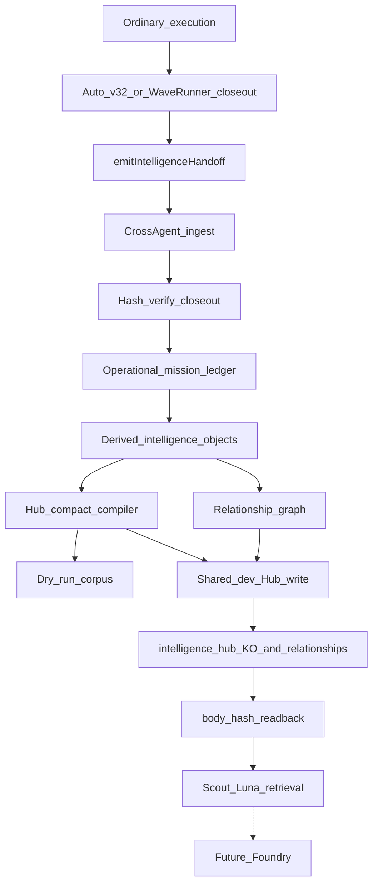

# Project: operational-intelligence-envelope-v1

## Architecture lock

| Field | Value |
| --- | --- |
| Status | **ARCHITECTURE_LOCKED** |
| Owner | CapitalGlass-Cross-Agent |
| Producer | CG-AppBuilder-MCP |
| Work package | `capital-glass-compounding-operational-measurement-v1` |
| Plan ID | `operational-intelligence-envelope-v1` |
| Terminal milestone | `CAPITAL_GLASS_COMPOUNDING_OPERATIONAL_INTELLIGENCE_V1_PROVEN` |
| Epoch | `a3b82edb4` |
| Plan content hash | `sha256:eb06a718cc049a45e3bae8a2fc48ef4d3948e37ae72420ba681158272d8b62c0` |
| Change policy | Future changes require an explicit superseding plan; do not silently edit this architectural decision |

**WaveRunner registration:** `CG-AppBuilder-MCP/scripts/sdlc-protocol-cursor/waverunner-capability-registry-v1.json` → `INTELLIGENCE_HANDOFF` (`IMPLEMENTED_AND_PROVEN`, `required: false` until operator promotes required gate).

**Implementation status (2026-08-25):**

| Step | Status |
| --- | --- |
| 1 Contracts + fixtures | **COMPLETE** — `npm run test:intelligence-contracts` |
| 2 Ingest CLI dry-run | **COMPLETE** — `npm run test:intelligence-ingest` |
| 3 Shared-dev Hub seam | **COMPLETE** — memory-store readback + gated live store (`CROSS_AGENT_INTELLIGENCE_HUB_PROJECTION_APPROVED=1`, `INTELLIGENCE_HUB_LIVE_WRITES=true`) |
| 4 AppBuilder emit hook | **COMPLETE** — `npm run test:intelligence-handoff-emit` + ownership guard |
| 5 First-real-mission harness | **PROVEN LIVE (2026-08-25)** — `scripts/intelligence/prove-first-real-mission-v1.mjs`, evidence from the completed `mcp-estate-remediation-v1` mission (real commit `0b389796e7f2d0fe7b75393a8213135648f72a91`). `FIRST_REAL_MISSION_HUB_PROOF_PASS`, all 10 harness checks true, independently re-verified via a separate SQL query against `intelligence_hub.knowledge_objects`/`.relationships` (11 objects, real `ABOUT`/`OBSERVED_IN`/`PROVEN_BY` relationships, correct `authority_commit`). Getting here required two infra/code fixes, both landed: (a) the `intelligence_hub` Postgres schema was not in the project's PostgREST-exposed schema list (Supabase Data API config, not RLS); (b) `createSupabaseClient()` in `CG-AppBuilder-MCP/scripts/intelligence-hub/lib/supabase-env.mjs` silently re-resolved credentials with its own defaults, discarding a caller's `preferMcpControlPlane` choice and connecting to the wrong Supabase project (the one the harvest pipeline's own `assertControlPlaneTarget()` explicitly forbids) even when the caller's own env resolution was correct. |
| 6 Verification checklist | **COMPLETE** — `npm run test:intelligence-verification` |

**Downstream intelligence ownership (not an AppBuilder capability):**

| Field | Value |
| --- | --- |
| AppBuilder capability | `INTELLIGENCE_HANDOFF` → evidence producer only |
| Downstream pipeline owner | CapitalGlass-Cross-Agent |
| Downstream capability | `COMPOUNDING_INTELLIGENCE_PIPELINE` |

## Summary

Single-owner WaveRunner intelligence envelope: Cross-Agent owns the full compounding-intelligence pipeline after closeout; AppBuilder emit-only handoff. OP-00A closed-core envelope with open extensions. First-real-mission gate requires shared-dev live Hub `knowledge_objects` + `relationships` readback (production Hub not in scope). Preserve high-resolution `measurementQuality`; `evidenceReality` is separate.

**Disposition:** APPROVED after 2 material amendments (shared-dev Hub required; measurementQuality preserved)

---

# WaveRunner Intelligence Envelope — Single-Owner Plan

**Work package:** `capital-glass-compounding-operational-measurement-v1` / `operational-intelligence-envelope-v1`  
**Disposition:** APPROVED after 2 material amendments (shared-dev Hub required; measurementQuality preserved)  
**Primary owner:** CapitalGlass-Cross-Agent  
**Evidence producer:** CG-AppBuilder-MCP (emit-only)  
**Epoch context:** published SHA `a3b82edb4` — measurement cohort counting only after first-mission Hub proof

## Locked architecture

```text
APPBUILDER       = DO THE WORK
CROSS-AGENT      = LEARN FROM THE WORK
INTELLIGENCE HUB = MAKE WHAT WAS LEARNED AVAILABLE
WAVERUNNER       = CONTROL WHAT HAPPENS NEXT
```

**One owner after ordinary execution finishes.**

| System | Owns |
|--------|------|
| **CapitalGlass-Cross-Agent** | Producer-client contract, operational mission ledger, intelligence envelope, derived objects, relationship graph, Hub compact compilation, shared-dev Hub publication request, retrieval/provenance reconstruction, future Foundry input |
| **CG-AppBuilder-MCP** | Ordinary closeout + minimal `emitIntelligenceHandoff` only |
| **Intelligence Hub** | Index/store `DERIVED_INTELLIGENCE` (never progression authority) |
| **WaveRunner / Git** | Progression / execution control (not concepts, ROI signals, or synthesis) |



AppBuilder owns only closeout + handoff emit. Everything from ingest downward is Cross-Agent.

---

## Why this is elevation (not wording)

Prior plans still split “AppBuilder owns producer / Cross-Agent owns projection” → **two owners**. Existing drift:

- `CG-AppBuilder-MCP/scripts/sdlc-protocol-cursor/lib/export-waverunner-handoff.mjs` builds harvest JSON into Cross-Agent
- WaveRunner self-improvement harvest schemas use a different authority chain
- Harvest Hub seed publishes **HARVEST_AUTHORITY**, not DERIVED_INTELLIGENCE

**This package must not extend those seams into an intelligence engine.**

### Reuse primitives, not product meaning

| Reuse from Cross-Agent harvest | Do **not** reuse as intelligence product |
|--------------------------------|------------------------------------------|
| `hash.mjs` / canonical JSON | `export-waverunner-self-improvement` candidate export |
| Volatile-key stripping in publication-identity-lib | Harvest seed-packet compiler as derived-object builder |
| Publication-lock / single-flight pattern | Live L: harvest catalog as the DERIVED path |
| Dry-run layout under `artifacts/agent-runs/<id>/` | HARVEST_AUTHORITY Hub seed objects |

New code lives in a **sibling tree**, not inside harvest export:

```text
CapitalGlass-Cross-Agent/
  contracts/intelligence/
  scripts/intelligence/
  scripts/tests/intelligence/
  work-progress/projects/operational-intelligence-envelope-v1.md
```

**Three jobs stay separate:** Harvest = evidence collection · Intelligence = learning from evidence · Foundry = later consumes intelligence.

---

## Ownership law (encode as tests)

**Cross-Agent may:** validate handoffs, project ledgers, build derived objects, hash envelopes, generate edges, compile Hub compact objects, reconstruct provenance, dry-run publish, **shared-dev live Hub write/readback**.

**AppBuilder may:** write ordinary closeout, hash that closeout, emit handoff `{ closeoutRef, closeoutHash, workPackageId, authorityFingerprint, … }`, optionally invoke Cross-Agent ingest CLI.

**AppBuilder must not contain:** envelope schema, ledger projector, derived-object constructors, derivation-graph builders, Hub compact compiler, relationship-edge generator, Foundry/synthesis logic, or code that decides what a concept means.

**Architecture tests (required):**

- FAIL if AppBuilder grows `operational-intelligence-envelope`, `derivedFrom`, `DERIVED_INTELLIGENCE`, or Hub compact compilation
- FAIL if Cross-Agent ingest accepts a payload that already contains derived objects from the producer

**Producer registry is open; ownership is not.** AppBuilder is first producer. Bid Composer / Computer Estimator may later emit the same Cross-Agent-owned handoff. They never become intelligence-model owners.

**Do not** enlarge `exportWaverunnerHandoff` into this pipeline. **Do not** implement OP-00A–OP-11 inside AppBuilder.

---

## AppBuilder change surface (tiny)

Hook ordinary Auto v3.2 closeout in `CG-AppBuilder-MCP/scripts/auto-protocol-v3/session-closeout-lib.mjs`.

Add one client: `scripts/auto-protocol-v3/emit-intelligence-handoff.mjs` → writes:

`artifacts/agent-runs/<work-package-id>/intelligence-handoff-v1.json`

### Handoff fields (schema owned by Cross-Agent)

```text
schema: intelligence-handoff-v1@1.0.0
workPackageId
closeoutRef          # path to session-closeout-v3.2.json or WaveRunner closeout
closeoutHash         # sha256:…
authorityFingerprint # bible hash, protocol overlay, closeout schema, producer repo, producer SHA, mission class, material flag
producer: CG-AppBuilder-MCP
observedAt
# NO derived objects, ledger rows, or Hub payloads
```

- Material closeouts emit **automatically**
- Non-material / investigate: do not emit
- Handoff failure: **warn-and-record**, never closeout hard-fail, never silently skipped without a receipt

### Capability registry (`CG-AppBuilder-MCP/scripts/sdlc-protocol-cursor/waverunner-capability-registry-v1.json`)

Initial registration (implementation in progress):

- `INTELLIGENCE_HANDOFF` = `SPEC_ONLY`, `required: false`
- Promote to `IMPLEMENTED_AND_PROVEN`, `required: true` after emit hook tests pass
- `COMPOUNDING_INTELLIGENCE_PIPELINE` is **not** registered as an AppBuilder capability; downstream ownership is recorded in plan + registry metadata only

---

## Cross-Agent pipeline (one ingest, many stages)

```bash
npm run intelligence:ingest -- --handoff=<path> --dry-run --json
npm run intelligence:ingest -- --handoff=<path> --shared-dev-hub --json
```

Stages (all Cross-Agent):

1. Validate handoff against `contracts/intelligence/intelligence-handoff-v1.schema.json`
2. Load and **independently hash-verify** referenced closeout
3. Project operational mission ledger
4. Build derived objects (OP-00A envelope)
5. Generate relationship edges
6. Compile Hub compact objects
7. **Mode A (default/CI):** dry-run corpus under `artifacts/agent-runs/operational-intelligence-envelope-v1/intelligence-dry-run/` — no L:/Z: writes
8. **Mode B (shared-dev / first-mission gate):** write `intelligence_hub.knowledge_objects` + `relationships` + `body_hash` readback
9. Retrieval + provenance reconstruction

**Idempotent:** same `closeoutHash` + same `derivationVersion` → same ledger id and object content hashes.

Reject for first-real-mission gate: synthetic / fixture / proof-wave closeouts (e.g. `build-proof-wave-closeout.mjs`).

---

## OP-00A — Future Intelligence Durability Contract

`contracts/intelligence/operational-intelligence-envelope-v1.schema.json`

Every derived object: **closed core** + **open `extensions` bag**.

### Closed core (required)

- **identity:** `objectId`, `kind`, `schema`, `contentHash`, `derivationVersion`
- **authority:** `authorityClass=DERIVED_INTELLIGENCE`, `progressionAuthority=false`, `rawTelemetryDuplicated=false`
- **temporal:** `observedAt`, `validFrom`, `validThrough`, `measurementWindowStart`, `measurementWindowEnd`, `lastRevalidatedAt`
- **lifecycle:** `lifecycleStage`, `supersedes[]`, `supersededBy`, `invalidated`, `invalidationReason`
- **evidenceState:** `supportingEvidenceRefs[]`, `contradictingEvidenceRefs[]`, `rejectedEvidenceRefs[]`
- **confidence:** `score`, `basis[]`, `calculationVersion`
- **derivation:** `derivedFrom[]` with `objectId`, `relationship`, `contribution`, `evidenceWeight`
- **futureUse:** `retrievalEligible`, `startupContextEligible`, `synthesisEligible`, `agentExplorationEligible`, `opportunityMiningEligible`
- **measurement:** high-resolution quality + supporting metrics
- **evidenceReality:** `REAL` | `FIXTURE` | `SYNTHETIC` (orthogonal to measurement quality)
- **extensions:** open bag for future fields/kinds

### Do not collapse measurement provenance

**Keep** `measurement.measurementQuality`:

```text
DIRECT_MEASURED | PAIRED_MEASURED | PROVIDER_VERIFIED | CACHE_VERIFIED | ESTIMATED | INFERRED | SYNTHETIC
```

**Separately** `evidenceReality: REAL | FIXTURE | SYNTHETIC`

| Question | Field |
|----------|-------|
| How was the metric measured? | `measurementQuality` |
| Was this generated by actual operational work? | `evidenceReality` |

First-real-mission gate requires **`evidenceReality = REAL`**.

### Approved Phase-1 kinds (registry data, not a closed switch)

`COMPOUNDING_EPOCH_SUMMARY`, `INTELLIGENCE_VALUE_SIGNAL`, `RECEIPT_LEVERAGE_SIGNAL`, `MISSED_REUSE_PATTERN`, `CROSS_REPO_TRANSFER_PATTERN`, `RANKING_CALIBRATION_SIGNAL`, `MISSION_CLASS_PROFILE`, `EMERGENT_CONCEPT_CANDIDATE`

**Unknown future kinds validate if they satisfy the closed core** (no-migration rule).

### OP-00A acceptance flags

`historicalTruthCanExpire`, `derivedObjectCanBeSuperseded`, `derivedObjectCanBeInvalidated`, `contradictingEvidencePreserved`, `rejectedEvidencePreserved`, `derivationCanBeReconstructed`, future eligibility flags, `schemaSupportsFutureConceptClassesWithoutMigration`, `rawTelemetryDuplicatedIntoHub=false`, `hubProgressionAuthority=false`, `measurementQualityTaxonomyPreserved=true`, `evidenceRealityOrthogonal=true`

**Fixtures:** expired, superseded, contradictory/rejected evidence, reconstructable concept graph, unknown-future-kind, measurementQuality × evidenceReality matrix.

History never deleted. Stable `objectId`; material change → new `contentHash` + supersession edge.

---

## Mission-ledger projector

Handoff + verified closeout → compact projection (not a second closeout).

Required: source hashes, producer/consumer missions, repos, mission class, measurement quality, evidence reality, confidence, freshness, avoided work, evidence refs, authority fingerprint.

**Fail closed on:** missing closeout, hash mismatch, invalid authority fingerprint, synthetic/cohort-like input, producer-supplied derived objects.

Raw closeouts remain **evidence authority**. Ledger is a projection.

---

## Derived-intelligence builder

Deterministic constructors only. No LLM synthesis.

`EMERGENT_CONCEPT_CANDIDATE` must carry `derivedFrom[]` derivation graph.

**Proof B (representation only):** same `MISSED_REUSE_PATTERN` across ≥3 repos may emit a candidate. Not Foundry. Do not mine a 25-mission cohort in this package.

---

## Hub compact seam + relationship edges

### Dry-run

`artifacts/agent-runs/operational-intelligence-envelope-v1/intelligence-dry-run/` — never writes L: or Z:.

### Shared-dev live Hub (required for first-real-mission)

```text
productionHubPublication = NOT_IN_SCOPE
sharedDevHubPublication  = REQUIRED  (for FIRST_REAL_MISSION_HUB_PROOF_PASS)
```

```text
REAL MATERIAL MISSION
  → ordinary closeout
  → intelligence handoff
  → Cross-Agent hash verification
  → mission ledger projection
  → derived intelligence envelope
  → deterministic content hash
  → shared-dev Hub publication
       → intelligence_hub.knowledge_objects
       → intelligence_hub.relationships
  → body_hash readback
  → retrieval proof
  → provenance reconstruction
```

Do **not** publish through harvest seed / `HARVEST_AUTHORITY`. Mechanical AppBuilder Hub scripts may run as workers; semantics stay Cross-Agent.

---

## First-real-mission harness

Remain `WAITING_FOR_REAL_MISSION` until a **genuine** ordinary material mission naturally occurs (do not manufacture one). Proof-wave/fixture closeouts ineligible.

### `FIRST_REAL_MISSION_HUB_PROOF_PASS` requires all:

- `realEvidence` / `evidenceReality=REAL`
- `closeoutHashVerified`
- `ledgerProjected`
- `envelopeValidated`
- `objectHashDeterministic`
- `sharedDevKnowledgeObjectWritten`
- `relationshipWritten`
- `hubBodyHashReadbackMatch`
- `retrievalSuccessful`
- `provenanceReconstructed`

**Only after that** may history accumulate toward the eventual 25-mission measurement cohort (later phase — not manufactured here).

---

## Expected acceptance states

| Surface | State |
|---------|--------|
| Cross-Agent contracts/pipeline | `LOCAL_RUNTIME_VALIDATED` |
| Dry-run ingest | `LOCAL_RUNTIME_VALIDATED` |
| AppBuilder handoff | `IMPLEMENTED_AND_PROVEN` |
| Shared-dev Hub semantic path | `READY_FOR_REAL_MISSION` |
| First-real-mission | `WAITING_FOR_REAL_MISSION` until genuine evidence |
| After genuine evidence + shared-dev proof | `FIRST_REAL_MISSION_HUB_PROOF_PASS` |
| Production Hub publication | `NOT_IN_SCOPE` |
| Foundry / production activation | inactive |

---

## Explicit non-goals

- No Foundry / overnight agent / opportunity miner / strategic synthesizer
- No manufactured 25/100/1000-mission cohort or fake first real mission
- No Hub progression authority
- No production L:/Z: Hub publication claim (shared-dev only for gate)
- No Data-Extraction ingest for this pipeline
- No AppBuilder intelligence-model code / second envelope in AppBuilder or Governance
- No collapsing measurementQuality into observed|inferred|synthetic

---

## Implementation order

1. Cross-Agent ownership note + handoff/envelope schemas + OP-00A fixtures (measurementQuality × evidenceReality)
2. Cross-Agent ingest CLI: validate → ledger → objects → edges → compact → provenance; dry-run mode
3. Shared-dev Hub publish + readback path (gated; not production)
4. AppBuilder emit-only hook + delegated capability pointer + ownership tests
5. First-real-mission harness, fail-closed until `FIRST_REAL_MISSION_HUB_PROOF_PASS`
6. Independent verification across schemas, hashes, dry-run, edges, reconstruction, shared-dev Hub checklist, ownership absence

---

## Principle

Every genuine mission begins creating future-Foundry-quality institutional intelligence from day one — including a **proven shared-dev Hub semantic path** — not merely files we hope to interpret correctly later.
